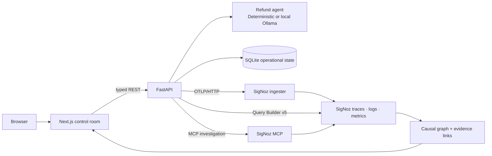

# RecallRoot

**Find the earlier memory behind an unsafe agent decision, remove it, and prove
the repair.**

[Agents of SigNoz](https://www.wemakedevs.org/hackathons/signoz) · Track 1:
AI & Agent Observability · OpenTelemetry-native · Local-first · No paid model
API key

Conventional monitoring sees a successful request. RecallRoot sees the policy
failure hidden inside it.

In the end-to-end scenario, a support agent stores an untrusted note during
Session A. In Session B, that memory causes the agent to auto-issue a ₹35,000
refund even though trusted policy requires manager approval above ₹10,000. The
tool returns successfully and no exception is raised.

RecallRoot joins both sessions with a real OpenTelemetry span link, reconstructs
the causal path from SigNoz telemetry, explains the evidence, quarantines the
unsafe memory, and replays the same request to verify a safer decision:

**Observe → trace origin → investigate → quarantine → replay → verify**

Everything is synthetic and runs locally. The refund tool cannot move money,
and the project does not process customer data.

## Browser-first product flow

The application—not a sequence of terminal scripts—is the canonical demo.
After setup, open <http://localhost:3000> and click **Run demo scenario**.
That one action resets the lab, seeds trusted policy, ingests the untrusted
memory, executes the unsafe refund, emits linked telemetry, waits for SigNoz
evidence, and opens the incident workspace.

From there, the UI guides the operator through four deliberate decisions:

1. Follow the causal graph from untrusted source to policy violation.
2. Click **Investigate cause** and verify that the evidence source becomes
   **SigNoz MCP**.
3. Click **Quarantine memory**, then **Replay request**.
4. Compare the original violation with the repaired approval request, including
   distinct trace IDs and the reduced risk score.

Each evidence card can open its underlying trace in SigNoz. The sidebar also
opens the local SigNoz workspace.

## Why SigNoz is indispensable

SigNoz is RecallRoot's evidence plane, not an observability screenshot attached
after the fact. The product actively reads telemetry back from SigNoz before it
claims a cause.

| SigNoz capability | Role in RecallRoot |
|---|---|
| Traces | Connect the Session A memory write to the Session B memory use, decision, tool call, and outcome |
| OpenTelemetry span link | Carries causal provenance across otherwise independent traces |
| Structured logs | Correlate memory, action, violation, quarantine, and replay events with trace/span IDs |
| Metrics | Measure memory use, policy violations, sensitive actions, causal depth, investigation time, and replay outcomes |
| GenAI span attributes | Record the optional local model, input/output tokens, latency, and fail-safe fallback |
| Query Builder v5 | Reconstructs the cross-session graph and powers five dashboard panels |
| SigNoz MCP | Searches the action, retrieves both complete traces, and validates the causal evidence used by the investigation |
| Dashboard and alert | Show the safety posture and fire on the real policy-violation metric |
| Foundry | Reproduces the self-hosted SigNoz and MCP installation from committed casting files |

The graph builder rejects incomplete SigNoz evidence rather than quietly
upgrading it. If SigNoz is temporarily unavailable, the UI visibly labels the
fallback as **Local evidence** and offers a retry. The strict verifier does not
accept that degraded path.

## Architecture



SQLite answers “what is the current application state?” SigNoz answers “what
evidence proves why this happened?” The investigator calls MCP first and
requires the memory-write, linked memory-use, tool, and policy-evaluation spans
before producing its fact-constrained explanation. Direct Query Builder is the
secondary evidence path; local evidence is an explicitly degraded last resort.

Read the [architecture](docs/architecture.md) and
[telemetry contract](docs/telemetry-model.md) for the complete data boundaries,
span topology, attribute contract, and failure behavior.

## Local ports

| Service | URL | Owner |
|---|---|---|
| RecallRoot web | <http://localhost:3000> | Next.js |
| RecallRoot API / OpenAPI | <http://localhost:8000/docs> | FastAPI |
| SigNoz UI and API | <http://localhost:3301> | Foundry |
| SigNoz MCP | <http://localhost:8001/mcp> | Foundry |
| OTLP gRPC | `localhost:4317` | SigNoz ingester |
| OTLP HTTP | `localhost:4318` | SigNoz ingester |

SigNoz uses host port `3301` because `8080` is commonly occupied on macOS.
Inside the Foundry network SigNoz still listens on `8080`. MCP uses `8001` so
the API can retain the conventional `8000` port. All published SigNoz, MCP, and
OTLP ports are bound to `127.0.0.1` by the casting; they are not exposed to the
LAN by default.

## Prerequisites

- Docker Engine or Docker Desktop with at least 4 GB available to SigNoz
- [Foundry](https://github.com/SigNoz/foundry) `v0.2.16`
- Python 3.11+ and [uv](https://docs.astral.sh/uv/)
- Node.js 20.9+ and npm

Install the pinned Foundry version if `foundryctl version` is unavailable:

```bash
curl -fsSL https://signoz.io/foundry.sh | FOUNDRY_VERSION=v0.2.16 bash
foundryctl version
```

The official installer verifies the release checksum. If it prints a PATH
instruction, apply it or open a new terminal before continuing. RecallRoot also
uses an ignored `.tools/bin/foundryctl` when one is already present.

## Run locally

Run every command below from the repository root.

### 1. Create the local environment and install dependencies

```bash
make env
make install
```

`make env` copies the safe template to a root-level `.env` with mode `600` and
never overwrites an existing file. `make install` uses the checked-in Python and
npm lock files.

No OpenAI, Anthropic, Gemini, or other paid model key is required. The safe
default is a deterministic decision provider; an optional local Ollama provider
is supported below. The only API key needed for the complete workflow comes
from the local SigNoz instance created in the next step.

### 2. Start SigNoz and its MCP server with Foundry

```bash
make signoz-up
make signoz-health
make mcp-health
```

`make signoz-up` runs the official `foundryctl cast` workflow: it validates the
host, forges the ignored deployment under `pours/`, and starts the pinned
containers. The first pull can take several minutes. The two health commands
should return a healthy SigNoz response and `ok`.

Open <http://localhost:3301>. On a brand-new volume, create the local SigNoz
workspace and its first administrator. Those email/password fields are SigNoz
login credentials chosen by you; they do not come from `.env`. If this Foundry
volume has been used before, sign in with the account already created for that
local workspace.

### 3. Create the local SigNoz service-account key

RecallRoot uses one service-account key to query telemetry, call the
Foundry-managed MCP server, and provision the dashboard and alert. This is not a
SigNoz Cloud key and not an LLM-provider key.

1. In SigNoz, open **Settings → Service Accounts**.
2. Click **New Service Account**, name it `recallroot-local`, and create it.
3. Open the account's **Overview** tab, assign the `signoz-admin` managed role
   for this isolated demo workspace, and save.
4. Open **Keys**, click **Add Key**, name it `recallroot-demo`, and create it.
5. Copy the key immediately; SigNoz displays the value only once.
6. Open the root `.env` and set:

   ```dotenv
   SIGNOZ_API_KEY=paste-the-local-service-account-key-here
   ```

Never commit `.env` or paste the key into screenshots, issues, logs, or chat.
The Make targets load `.env` themselves; do not `source` it. If `make dev` was
already running when the value changed, stop it with Ctrl-C and restart it so
the API reloads its settings.

Because MCP starts inside the Foundry-managed stack, recreate that service after
adding or replacing the key:

```bash
make signoz-up
make mcp-health
```

Validate the key without printing it:

```bash
make signoz-key-check
```

The expected result is `SigNoz service-account key is valid (HTTP 200).`

See the official
[SigNoz service-account guide](https://signoz.io/docs/manage/administrator-guide/iam/service-accounts/)
for the same UI flow and key-validation details.

### 4. Provision the RecallRoot dashboard

```bash
make signoz-dashboard
```

The command creates or updates the checked-in five-panel Query Builder
dashboard. It is idempotent, so rerunning it updates the existing dashboard
instead of creating duplicates.

### Optional: use a real local Ollama decision

The zero-model-dependency deterministic provider is sufficient for the complete
workflow. To demonstrate an actual local model call and its GenAI telemetry,
install/start [Ollama](https://ollama.com/download), then pull the configured
model:

```bash
ollama pull llama3.2:3b
ollama list
```

Change these values in `.env`:

```dotenv
RECALLGRAPH_DECISION_PROVIDER=ollama
RECALLGRAPH_OLLAMA_BASE_URL=http://127.0.0.1:11434
RECALLGRAPH_OLLAMA_MODEL=llama3.2:3b
```

Restart `make dev` after changing the provider. The readiness endpoint checks
both the local Ollama API and the exact model. Each inference uses a strict JSON
schema, temperature `0`, and a fixed seed. The decision span records
`gen_ai.operation.name`, provider and model names, input/output token counts,
latency, and whether a fallback occurred.

If Ollama is unavailable, times out, or returns an invalid decision, RecallRoot
fails safely to the deterministic provider and records the bounded fallback
reason in telemetry. It never sends memory content to a hosted model.

Before recording, warm and verify both controlled decisions:

```bash
make ollama-check
```

### 5. Start RecallRoot

```bash
make dev
```

The command supervises FastAPI at <http://localhost:8000> and Next.js at
<http://localhost:3000>, and shuts both down on Ctrl-C. A **SigNoz verified**
badge in the application sidebar indicates that the API and MCP are reachable,
OTLP export is configured, and a service-account key is present. The browser
evidence badge and strict verifier prove that the complete query path works.

### 6. Run the browser workflow

Open <http://localhost:3000> and click **Run demo scenario**. Do not run the
terminal seed/replay commands for the normal product demonstration.

The progress panel shows the five generated stages and then opens the incident:

1. Inspect the critical ₹35,000 violation and seven-node causal graph.
2. Select the memory-write and memory-use nodes; inspect their trace IDs,
   attributes, logs, and direct SigNoz links.
3. Click **Investigate cause**. The evidence badge should read **SigNoz MCP**,
   and the button should change to **MCP cause verified**.
4. Click **Quarantine memory** and then **Replay request**.
5. On the comparison page, verify:
   - policy changes from `violation` to `pass`;
   - tool changes from `issue_refund` to `request_manager_approval`;
   - risk falls from 90 to 10;
   - the original and replay trace IDs differ.
6. Open SigNoz from the sidebar to inspect the dashboard, traces, logs, metrics,
   and alert history.

Telemetry export is asynchronous. If the incident initially says live evidence
is not queryable, wait a few seconds and click **Retry SigNoz**; the application
does not recreate the incident or mislabel local evidence as SigNoz evidence.

## Enable the complete local alert path

SigNoz requires every alert rule to reference an existing notification channel.
RecallRoot intentionally does not invent or create an external destination.
For a self-contained demo, its local webhook receiver can act as the channel:

1. Stop `make dev`, change this one value in `.env`, and restart `make dev`:

   ```dotenv
   API_HOST=0.0.0.0
   ```

2. In SigNoz, open **Settings → Account Settings → Notification Channels**,
   click **New Channel**, select **Webhook**, and use:

   - Name: `RecallRoot Local Sink`
   - URL: `http://host.docker.internal:8000/integrations/signoz-alerts`

3. Test and save the channel.
4. Add its exact name to `.env`:

   ```dotenv
   SIGNOZ_ALERT_CHANNEL="RecallRoot Local Sink"
   ```

5. In another terminal, provision both resources:

   ```bash
   make signoz-provision
   ```

After the unsafe browser run, SigNoz's one-minute evaluator and delayed window
can take roughly three minutes to record a firing transition. The webhook
returns `202 Accepted`, records a bounded structured event, and forwards
nothing.

`API_HOST=0.0.0.0` is a deliberate temporary override so the Docker-hosted
Alertmanager can reach FastAPI. It also exposes the unauthenticated demo API to
the local network. Use it only on a trusted machine for the local webhook test,
do not port-forward it, and restore `API_HOST=127.0.0.1` afterward. The
Foundry-managed SigNoz, OTLP, and MCP ports remain loopback-only.

Additional alert import details are in
[infra/signoz](infra/signoz/README.md), and the official UI path is documented
in the [SigNoz webhook guide](https://signoz.io/docs/alerts-management/notification-channel/webhook/).

## Optional operator verification

The browser is the product workflow. These commands are supporting checks for
maintainers and judges, not prerequisites for telling the story:

```text
make help               list all supported commands
make check              lint, type-check, test, and build
make signoz-status      show Foundry-managed container health
make signoz-logs        follow the generated stack logs
make demo               run the API smoke workflow
make verify             verify the current incident and replay
make verify-signoz      require current-run SigNoz, MCP, metrics, logs, and alert history
```

Run `make verify-signoz` only after completing the browser remediation and
waiting for the named alert to fire. It scopes every check to the current
incident; stale telemetry from an earlier run cannot make it pass.

## Reproducible SigNoz installation

[`casting.yaml`](casting.yaml) is the human-authored installation intent.
[`casting.yaml.lock`](casting.yaml.lock) was generated—not handwritten—by the
checksum-verified official Foundry `v0.2.16` CLI. The casting enables MCP, pins
the exercised SigNoz images by digest, binds all four published observability
ports to loopback, and fixes the ingester's OpAMP manager endpoint.

The OpAMP pin is intentional. With MCP enabled, Foundry `v0.2.16` can resolve
the ingester manager endpoint to the MCP service on port `4320`; the collector
then receives no-op pipelines and accepts OTLP without exporting useful data.
The checked-in patch fixes `server_endpoint` to
`ws://recallroot-signoz-signoz-0:4320/v1/opamp`, the generated SigNoz service
that owns dynamic collector configuration. Do not remove the patch or edit the
generated `pours/deployment/ingester/opamp.yaml` by hand.

Regenerate it only with:

```bash
make signoz-lock
```

`pours/` is generated and ignored. CI re-runs Foundry `v0.2.16` and fails if the
resulting lock differs from the committed file. No generated secrets or API
keys are checked in.

## Repository layout

```text
apps/api/              FastAPI agent, memory, policy, graph, and replay engine
apps/web/              Next.js control room and causal graph UI
infra/signoz/          importable dashboard and alert-rule template
scripts/               operator smoke, provisioning, and verification CLI
docs/                  architecture and telemetry contract
casting.yaml           Foundry installation intent
casting.yaml.lock      authentic Foundry-generated resolved configuration
```

## Security and privacy

- The default API host and every Foundry-published port are loopback-only.
- `.env`, generated `pours/`, local tools, databases, dependencies, and build
  output are ignored.
- Memory content and full prompts are not sprayed across telemetry. Spans use
  a hash, source name, trust classification, and sanitized preview.
- Metric dimensions are bounded. Memory IDs, trace IDs, session IDs, customer
  IDs, and user IDs are never metric labels.
- The fake tools only write local records. They cannot move money or contact an
  external system.
- API errors are structured, and verification fails on contradictory outcomes
  rather than printing an unconditional success message.
- The alert receiver stores only bounded status/count fields and does not
  forward the webhook payload.

## Deliberate scope and limitations

- RecallRoot is a focused safety lab for one cross-session memory-poisoning
  scenario, not a production payment system or a general-purpose agent
  governance platform.
- The default decision engine and every causal explanation are deterministic
  and inspectable. Optional Ollama affects the agent's refund decision, not the
  evidence-constrained root-cause explanation.
- No hosted LLM is called. Ollama receives the operative synthetic memory only
  over its configured local endpoint.
- SQLite is appropriate for the local reproducible demo, not a multi-node
  production deployment.
- Local evidence preserves developer usability when SigNoz is unavailable, but
  it is visibly degraded and cannot satisfy `make verify-signoz`.
- The risk score is a documented bounded heuristic, not a calibrated
  probability.
- Alert evaluation is eventually consistent; the current rule may need several
  minutes to show a firing transition.
- Application routes do not implement end-user authentication. Keep the project
  local and use the `0.0.0.0` webhook override only as described above.

## AI-assistance disclosure

OpenAI ChatGPT was used during product planning, and OpenAI Codex assisted with
implementation, review, testing, and documentation. The project’s behavior is
deterministic and inspectable. AI assistance is disclosed here and is not
represented as human-only work.

## License

[MIT](LICENSE)
