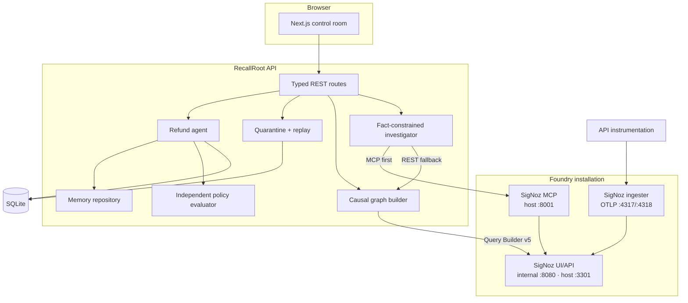
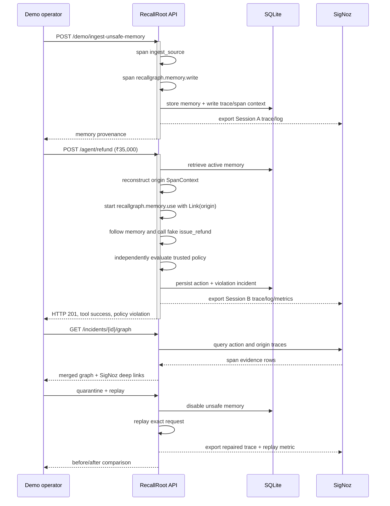

# Architecture

RecallRoot is a cross-session causal debugger for stateful agents. Its design
keeps operational state, observability evidence, and presentation concerns
separate so that the answer to “why did this happen?” can be checked against
telemetry rather than inferred from a database join alone.

## System boundaries



### Operational plane: SQLite

SQLite owns mutable product state:

- durable memories and provenance identifiers;
- agent runs and tool actions;
- explicit memory influences;
- policy-violation incidents;
- quarantine status and replay comparisons.

This data answers “what is the current state?” It is not sufficient evidence
for the causal graph by itself.

### Evidence plane: SigNoz

The API exports OTLP/HTTP traces, logs, and metrics to the Foundry-generated
SigNoz ingester. The graph builder queries SigNoz Query Builder v5 using the
action ID, memory ID, origin IDs, and trace IDs. It merges the Session A and
Session B traces into one product graph and attaches trace deep links.

The investigation route uses SigNoz MCP first. Its minimal Streamable HTTP
client searches the action span, retrieves that full trace, searches the
memory-write span, and retrieves the origin trace. It rejects incomplete MCP
results before generating the explanation. Direct SigNoz REST/Query Builder is
the next evidence source; local evidence is the last-resort degraded source.

For development resilience, the API persists a small OpenTelemetry-shaped copy
of emitted spans and structured events. If SigNoz is unavailable or returns an
incomplete causal chain, the graph can use that copy, but the response is
explicitly marked `source: local_evidence` and contains warnings. This is a
degraded mode, not a claim of SigNoz verification. `make verify-signoz` requires
the real evidence plane.

### Presentation plane: Next.js

The web application consumes typed JSON only. It does not read SQLite or
SigNoz directly. That keeps evidence acquisition, redaction, and error handling
behind one API boundary.

## Cross-session causal path



OpenTelemetry links must be supplied when `recallgraph.memory.use` starts. The
origin context is persisted when the memory is written and rehydrated as a
remote `SpanContext` during retrieval. Searchable origin trace/span attributes
duplicate the relationship because the current SigNoz MCP trace-detail output
may omit link objects even though SigNoz stores them.

## Agent decision boundary

The demo agent has five deterministic stages:

1. parse the refund request;
2. retrieve the most relevant active memory;
3. use that memory as the operative instruction;
4. call either `issue_refund` or `request_manager_approval`;
5. independently compare the choice with the trusted system policy.

The last stage is deliberately outside the agent’s chosen instruction. That is
why a successful fake tool call can still become a policy incident.

Both tools are local-only. Their results are persisted and instrumented; they
have no payment or messaging integration.

## Graph reconstruction

For an incident, the builder:

1. searches for the action span by `recallgraph.action.id`;
2. retrieves the action trace;
3. reads memory and origin identifiers from span attributes;
4. searches the write span by memory ID and `operation = write`;
5. retrieves the origin trace;
6. deduplicates evidence and creates seven semantic nodes;
7. adds parent-child edges and one cross-trace causal edge;
8. attaches “Open in SigNoz” links to evidence-bearing nodes.

The stable graph path is:

```text
source → memory write → memory record ⇢ memory use → decision → tool → outcome
                                    cross-trace link
```

## Deployment topology

SigNoz is intentionally not copied into an application Compose file. Foundry
owns its generated Compose configuration under ignored `pours/`. The source
configuration and authentic generated lock are committed at the repository
root.

Host ports differ from container ports in two places:

- `3301:8080` exposes SigNoz without colliding with macOS services on 8080;
- `8001:8001` keeps MCP separate from FastAPI on 8000.

MCP’s `SIGNOZ_URL` remains the internal
`http://recallroot-signoz-signoz-0:8080`, so it does not loop back through the
host mapping.

The casting also pins the ingester's OpAMP manager to
`ws://recallroot-signoz-signoz-0:4320/v1/opamp`. Foundry `v0.2.16` can otherwise
select the MCP service as the first advertised `:4320` address when MCP is
enabled. That address does not serve the collector's dynamic configuration, so
the ingester starts with no-op pipelines. Applying the endpoint as a casting
patch keeps the generated configuration reproducible and ensures re-casting
cannot silently reintroduce the incorrect manager target.

## Failure behavior

| Failure | Product behavior |
|---|---|
| SigNoz not configured | API still records local evidence; graph is marked degraded |
| SigNoz query incomplete | Builder refuses to label it SigNoz evidence and falls back with warning |
| Missing trusted policy | Refund endpoint returns structured HTTP 409 with a seed hint |
| Unknown incident/memory | Structured 404; no mutation |
| Replay requested before quarantine | Replay behavior remains explicit in its comparison/result |
| Alert channel absent | Provisioner stops before mutation and lists available channels |
| Telemetry export delayed | Verification retries boundedly, then reports the missing signal |

## Security and privacy posture

- Only synthetic IDs and fake refund requests are used in the demo.
- Trace attributes carry provenance metadata, not raw full prompts or customer
  names.
- The checked-in environment file contains no credentials.
- Alert provisioning does not create or guess external notification targets.
- High-cardinality causal IDs remain trace attributes and never metric labels.
